# 📊 Fitblog Database Schema

## Overview
Sơ đồ cơ sở dữ liệu cho hệ thống gợi ý sản phẩm fitness Fitblog sử dụng Collaborative Filtering.

---

## Entity Relationship Diagram (ERD) - Đầy Đủ


---

## Class Diagram (UML Style) - Cho Draw.io


---

## Database Schema Diagram - SQL DDL

```sql
-- ============================================================================
-- AUTH TABLES (Django Built-in)
-- ============================================================================

CREATE TABLE auth_user (
    id INTEGER PRIMARY KEY AUTO_INCREMENT,
    username VARCHAR(150) UNIQUE NOT NULL,
    email VARCHAR(254),
    password VARCHAR(128) NOT NULL,
    is_active BOOLEAN DEFAULT TRUE,
    is_staff BOOLEAN DEFAULT FALSE,
    date_joined DATETIME NOT NULL,
    last_login DATETIME,
    created_at TIMESTAMP DEFAULT CURRENT_TIMESTAMP,
    INDEX idx_username (username),
    INDEX idx_email (email),
    INDEX idx_date_joined (date_joined DESC)
);

-- ============================================================================
-- PRODUCT MODULE TABLES
-- ============================================================================

CREATE TABLE products_productcategory (
    id INTEGER PRIMARY KEY AUTO_INCREMENT,
    name VARCHAR(100) UNIQUE NOT NULL,
    slug VARCHAR(50) UNIQUE NOT NULL,
    description TEXT,
    icon_image VARCHAR(100),
    color VARCHAR(7) DEFAULT '#b39ddb',
    created_at DATETIME NOT NULL,
    PRIMARY KEY (id),
    INDEX idx_slug (slug),
    INDEX idx_name (name)
);

CREATE TABLE products_product (
    id INTEGER PRIMARY KEY AUTO_INCREMENT,
    name VARCHAR(255) NOT NULL,
    slug VARCHAR(255) UNIQUE NOT NULL,
    category_id INTEGER NOT NULL,
    supplement_type VARCHAR(20) NOT NULL,
    description TEXT,
    short_description VARCHAR(300),
    image VARCHAR(100),
    price DECIMAL(10,2) NOT NULL,
    discount_percent INTEGER DEFAULT 0,
    serving_size VARCHAR(50),
    protein_per_serving FLOAT,
    carbs_per_serving FLOAT,
    fat_per_serving FLOAT,
    calories_per_serving FLOAT,
    ingredients TEXT,
    flavor VARCHAR(100),
    status VARCHAR(20) DEFAULT 'active',
    stock INTEGER DEFAULT 0,
    tags VARCHAR(300),
    suitable_for_goals VARCHAR(300),
    embedding_vector JSON,
    seo_title VARCHAR(255),
    seo_description VARCHAR(255),
    created_at DATETIME NOT NULL,
    updated_at DATETIME NOT NULL,
    FOREIGN KEY (category_id) REFERENCES products_productcategory(id),
    INDEX idx_slug (slug),
    INDEX idx_status (status),
    INDEX idx_category (category_id),
    INDEX idx_supplement_type (supplement_type),
    INDEX idx_created_at (created_at DESC)
);

CREATE TABLE products_productflavor (
    id INTEGER PRIMARY KEY AUTO_INCREMENT,
    product_id INTEGER NOT NULL,
    flavor_name VARCHAR(100),
    stock INTEGER DEFAULT 0,
    created_at DATETIME NOT NULL,
    FOREIGN KEY (product_id) REFERENCES products_product(id),
    INDEX idx_product_id (product_id)
);

CREATE TABLE products_productreview (
    id INTEGER PRIMARY KEY AUTO_INCREMENT,
    product_id INTEGER NOT NULL,
    user_id INTEGER,
    author_name VARCHAR(100) NOT NULL,
    author_email VARCHAR(254),
    rating INTEGER NOT NULL,
    title VARCHAR(200),
    content TEXT,
    is_verified_purchase BOOLEAN DEFAULT FALSE,
    is_approved BOOLEAN DEFAULT FALSE,
    helpful_count INTEGER DEFAULT 0,
    created_at DATETIME NOT NULL,
    updated_at DATETIME NOT NULL,
    FOREIGN KEY (product_id) REFERENCES products_product(id),
    FOREIGN KEY (user_id) REFERENCES auth_user(id),
    UNIQUE KEY uk_user_product (user_id, product_id),
    INDEX idx_product_rating (product_id, rating DESC),
    INDEX idx_user_product (user_id, product_id),
    INDEX idx_user_created (user_id, created_at DESC),
    INDEX idx_created (created_at DESC),
    CHECK (rating >= 1 AND rating <= 5)
);

-- ============================================================================
-- USER PROFILE TABLES
-- ============================================================================

CREATE TABLE products_userprofile (
    id INTEGER PRIMARY KEY AUTO_INCREMENT,
    user_id INTEGER UNIQUE,
    age INTEGER,
    weight_kg FLOAT,
    height_cm FLOAT,
    gender VARCHAR(10),
    bmi FLOAT,
    tdee FLOAT,
    goal VARCHAR(50),
    activity_level VARCHAR(50),
    session_id VARCHAR(255),
    created_at DATETIME NOT NULL,
    updated_at DATETIME NOT NULL,
    FOREIGN KEY (user_id) REFERENCES auth_user(id),
    INDEX idx_user_id (user_id),
    INDEX idx_goal (goal),
    INDEX idx_activity_level (activity_level),
    INDEX idx_session_id (session_id)
);

CREATE TABLE products_passwordresettoken (
    id INTEGER PRIMARY KEY AUTO_INCREMENT,
    user_id INTEGER NOT NULL,
    token VARCHAR(100) UNIQUE NOT NULL,
    created_at DATETIME NOT NULL,
    expires_at DATETIME NOT NULL,
    is_used BOOLEAN DEFAULT FALSE,
    FOREIGN KEY (user_id) REFERENCES auth_user(id),
    INDEX idx_token (token),
    INDEX idx_user_id (user_id),
    INDEX idx_expires_at (expires_at)
);

-- ============================================================================
-- RECOMMENDATION TABLES
-- ============================================================================

CREATE TABLE products_recommendationlog (
    id INTEGER PRIMARY KEY AUTO_INCREMENT,
    user_id INTEGER,
    product_id INTEGER NOT NULL,
    algorithm_type VARCHAR(50),
    similarity_score FLOAT,
    predicted_rating FLOAT,
    event_type VARCHAR(20),
    score FLOAT,
    created_at DATETIME NOT NULL,
    FOREIGN KEY (user_id) REFERENCES auth_user(id),
    FOREIGN KEY (product_id) REFERENCES products_product(id),
    INDEX idx_user_created (user_id, created_at DESC),
    INDEX idx_product_id (product_id),
    INDEX idx_algorithm_type (algorithm_type),
    INDEX idx_created (created_at DESC)
);

-- ============================================================================
-- BLOG MODULE TABLES
-- ============================================================================

CREATE TABLE blog_category (
    id INTEGER PRIMARY KEY AUTO_INCREMENT,
    name VARCHAR(100) UNIQUE NOT NULL,
    slug VARCHAR(50) UNIQUE NOT NULL,
    description TEXT,
    created_at DATETIME NOT NULL,
    INDEX idx_slug (slug)
);

CREATE TABLE blog_post (
    id INTEGER PRIMARY KEY AUTO_INCREMENT,
    category_id INTEGER NOT NULL,
    author_id INTEGER NOT NULL,
    title VARCHAR(255) NOT NULL,
    slug VARCHAR(255) UNIQUE NOT NULL,
    content TEXT,
    status VARCHAR(20) DEFAULT 'draft',
    excerpt TEXT,
    featured_image VARCHAR(100),
    views INTEGER DEFAULT 0,
    likes INTEGER DEFAULT 0,
    published_at DATETIME,
    created_at DATETIME NOT NULL,
    updated_at DATETIME NOT NULL,
    FOREIGN KEY (category_id) REFERENCES blog_category(id),
    FOREIGN KEY (author_id) REFERENCES auth_user(id),
    INDEX idx_slug (slug),
    INDEX idx_status (status),
    INDEX idx_category (category_id),
    INDEX idx_author (author_id),
    INDEX idx_published (published_at DESC),
    INDEX idx_created (created_at DESC)
);

-- ============================================================================
-- LOGGING TABLES
-- ============================================================================

CREATE TABLE products_systemlog (
    id INTEGER PRIMARY KEY AUTO_INCREMENT,
    level VARCHAR(20),
    logger_name VARCHAR(255),
    message TEXT,
    traceback TEXT,
    created_at DATETIME NOT NULL,
    INDEX idx_level (level),
    INDEX idx_created (created_at DESC),
    INDEX idx_logger (logger_name)
);

-- ============================================================================
-- INDEXES FOR COMMON QUERIES
-- ============================================================================

-- Collaborative Filtering Queries
CREATE INDEX idx_cf_user_rating ON products_productreview(user_id, rating);
CREATE INDEX idx_cf_product_users ON products_productreview(product_id, user_id);

-- Product Discovery
CREATE INDEX idx_product_search ON products_product(name, description);
CREATE INDEX idx_category_products ON products_product(category_id, status);

-- User Analytics
CREATE INDEX idx_user_reviews ON products_productreview(user_id, is_approved);
CREATE INDEX idx_user_activity ON products_userprofile(goal, activity_level);
```

### 🔐 AUTH: User (Django Built-in)
```sql
CREATE TABLE auth_user (
    id INTEGER PRIMARY KEY,
    username VARCHAR(150) UNIQUE NOT NULL,
    email VARCHAR(254),
    password VARCHAR(128) NOT NULL,
    date_joined DATETIME,
    is_active BOOLEAN DEFAULT TRUE,
    ...
);
```

**Purpose:** Django authentication & authorization  
**Index:** `(username)`, `(email)`

---

### 👤 UserProfile
```sql
CREATE TABLE products_userprofile (
    id INTEGER PRIMARY KEY,
    user_id INTEGER UNIQUE,
    age INTEGER,
    weight_kg FLOAT,
    height_cm FLOAT,
    gender VARCHAR(10),
    bmi FLOAT,
    tdee FLOAT,
    goal VARCHAR(50),
    activity_level VARCHAR(50),
    created_at DATETIME,
    updated_at DATETIME,
    FOREIGN KEY (user_id) REFERENCES auth_user(id)
);
```

**Purpose:** Store user fitness profile & personalization data  
**Used for:** 
- BMI calculation
- TDEE estimation
- Goal-based recommendations
- User preference tracking

**Indexes:** 
- `(user_id)` - Quick lookup by user
- `(goal)` - Filter users by fitness goal
- `(activity_level)` - Activity-based filtering

---

### 🏷️ ProductCategory
```sql
CREATE TABLE products_productcategory (
    id INTEGER PRIMARY KEY,
    name VARCHAR(100) UNIQUE,
    slug VARCHAR(50) UNIQUE,
    description TEXT,
    icon_image VARCHAR(100),
    color VARCHAR(7),
    created_at DATETIME
);
```

**Purpose:** Supplement categories  
**Examples:** Whey Protein, Pre-workout, Vitamins, Fat Burner  
**Indexes:** `(slug)`

---

### 📦 Product
```sql
CREATE TABLE products_product (
    id INTEGER PRIMARY KEY,
    name VARCHAR(255),
    slug VARCHAR(255) UNIQUE,
    category_id INTEGER,
    supplement_type VARCHAR(20),
    description TEXT,
    short_description VARCHAR(300),
    image VARCHAR(100),
    price DECIMAL(10,2),
    discount_percent INTEGER,
    serving_size VARCHAR(50),
    protein_per_serving FLOAT,
    carbs_per_serving FLOAT,
    fat_per_serving FLOAT,
    calories_per_serving FLOAT,
    ingredients TEXT,
    flavor VARCHAR(100),
    status VARCHAR(20),
    stock INTEGER,
    tags VARCHAR(300),
    suitable_for_goals VARCHAR(300),
    embedding_vector JSON,
    created_at DATETIME,
    updated_at DATETIME,
    FOREIGN KEY (category_id) REFERENCES products_productcategory(id)
);
```

**Purpose:** Main product catalog  
**Key Fields:**
- `embedding_vector` - For content-based recommendations
- `suitable_for_goals` - Goal matching
- `tags` - Search & filtering
- `supplement_type` - Category filtering

**Indexes:**
- `(slug)` - Product URL lookup
- `(status)` - Filter active products
- `(supplement_type)` - Type filtering
- `(-created_at)` - Newest products first

---

### 🍦 ProductFlavor (Optional variants)
```sql
CREATE TABLE products_productflavor (
    id INTEGER PRIMARY KEY,
    product_id INTEGER,
    flavor_name VARCHAR(100),
    stock INTEGER,
    created_at DATETIME,
    FOREIGN KEY (product_id) REFERENCES products_product(id)
);
```

**Purpose:** Track flavor variants & stock per flavor  
**Examples:** Chocolate, Vanilla, Strawberry

---

### ⭐ ProductReview (For Collaborative Filtering)
```sql
CREATE TABLE products_productreview (
    id INTEGER PRIMARY KEY,
    product_id INTEGER NOT NULL,
    user_id INTEGER,
    author_name VARCHAR(100),
    author_email VARCHAR(254),
    rating INTEGER (1-5),
    title VARCHAR(200),
    content TEXT,
    is_verified_purchase BOOLEAN,
    is_approved BOOLEAN,
    helpful_count INTEGER,
    created_at DATETIME,
    updated_at DATETIME,
    FOREIGN KEY (product_id) REFERENCES products_product(id),
    FOREIGN KEY (user_id) REFERENCES auth_user(id),
    UNIQUE (user_id, product_id)
);
```

**Purpose:** 
- Store product reviews & ratings
- Build **user-item rating matrix** for Collaborative Filtering
- Each user can only have 1 rating per product

**Key for CF Algorithm:**
```
User-Item Matrix:
           Product1  Product2  Product3  ...
User1        5        3        NaN      ...
User2        4        NaN      5        ...
User3        NaN      2        4        ...
```

**Indexes:**
- `(product_id, -rating)` - Get top-rated reviews
- `(user_id, product_id)` - Unique constraint for CF
- `(user_id, -created_at)` - User's reviews timeline
- `(-created_at)` - Recent reviews

---

### 📊 RecommendationLog
```sql
CREATE TABLE products_recommendationlog (
    id INTEGER PRIMARY KEY,
    user_id INTEGER,
    product_id INTEGER,
    algorithm_type VARCHAR(50),
    similarity_score FLOAT,
    predicted_rating FLOAT,
    event_type VARCHAR(20),
    created_at DATETIME,
    FOREIGN KEY (user_id) REFERENCES auth_user(id),
    FOREIGN KEY (product_id) REFERENCES products_product(id)
);
```

**Purpose:** Track recommendation events for analytics & algorithm tuning  
**Algorithm Types:**
- `content-based` - Similar products
- `collab-filtering` - Collaborative filtering
- `goal-based` - Goal matching

**Indexes:**
- `(user_id, -created_at)` - User recommendation history
- `(product_id)` - Product recommendation popularity
- `(algorithm_type)` - Analytics by algorithm

---

## Data Flow Diagram

```mermaid
graph LR
    A["👤 User"] -->|Creates Profile| B["UserProfile"]
    A -->|Writes Reviews| C["ProductReview"]
    D["📦 Product"] --> C
    E["🏷️ Category"] --> D
    C -->|Rates Products| F["CF Algorithm<br/>User-Item Matrix"]
    F -->|Generates| G["Recommendations<br/>Predicted Ratings"]
    G -->|Logs Event| H["RecommendationLog"]
    A -->|Receives| G
    A -->|Clicks/Views| D
    D -->|Variants| I["ProductFlavor"]
```



---

## Collaborative Filtering Data Structure

### User-Item Rating Matrix
```
     P1(Whey)  P2(Pre)  P3(BCAA)  P4(Creatine)
U1    5        3        NaN       4
U2    4        NaN      5         2
U3    NaN      2        4         5
U4    3        5        NaN       NaN
```

**Data Source:** `ProductReview` table  
**Query Example:**
```sql
SELECT user_id, product_id, rating
FROM products_productreview
WHERE is_approved = TRUE
ORDER BY user_id, product_id;
```

---

## Key Relationships

| Relationship | Type | Purpose |
|--|--|--|
| User → UserProfile | OneToOne | User preferences & fitness data |
| User → ProductReview | OneToMany | User can write multiple reviews |
| ProductCategory → Product | OneToMany | Products grouped by category |
| Product → ProductReview | OneToMany | Products have multiple reviews |
| Product → ProductFlavor | OneToMany | Flavor variants per product |
| ProductReview → RecommendationLog | OneToMany | Recommendation event tracking |
| User → RecommendationLog | OneToMany | Track recommendations per user |

---

## Performance Optimization

### Indexes Strategy
```sql
-- Hot queries for product listing
CREATE INDEX idx_product_status ON products_product(status);
CREATE INDEX idx_product_category ON products_product(category_id);

-- Collaborative Filtering
CREATE INDEX idx_review_user_product ON products_productreview(user_id, product_id);
CREATE INDEX idx_review_rating ON products_productreview(product_id, rating DESC);

-- User profile lookups
CREATE INDEX idx_userprofile_goal ON products_userprofile(goal);
```

### Query Optimization Tips
1. Use `select_related()` for ForeignKey fields
2. Use `prefetch_related()` for reverse relations
3. Cache category data (rarely changes)
4. Use database pagination for product lists
5. Denormalize avg_rating in Product if needed

---

## Example Queries

### Get Product with Reviews
```sql
SELECT p.*, COUNT(pr.id) as review_count, AVG(pr.rating) as avg_rating
FROM products_product p
LEFT JOIN products_productreview pr ON p.id = pr.product_id AND pr.is_approved = TRUE
WHERE p.status = 'active'
GROUP BY p.id
LIMIT 10;
```

### Get User Recommendation
```sql
SELECT p.*, pl.predicted_rating, pl.similarity_score
FROM products_product p
JOIN products_recommendationlog pl ON p.id = pl.product_id
WHERE pl.user_id = 5 AND pl.algorithm_type = 'collab-filtering'
ORDER BY pl.predicted_rating DESC
LIMIT 5;
```

### Collaborative Filtering Input
```sql
SELECT pr.user_id, pr.product_id, pr.rating
FROM products_productreview pr
WHERE pr.is_approved = TRUE
ORDER BY pr.user_id;
```

---

## Notes
- ✅ Database supports PostgreSQL, SQLite, MySQL
- ✅ All timestamps in UTC (Django default)
- ✅ Soft deletes not implemented (hard delete on cascade)
- ✅ No explicit audit tables (use Django admin logs if needed)
- ✅ No denormalization for analytics (use data warehouse if needed)
