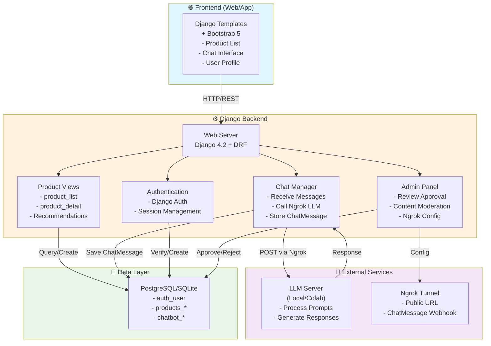
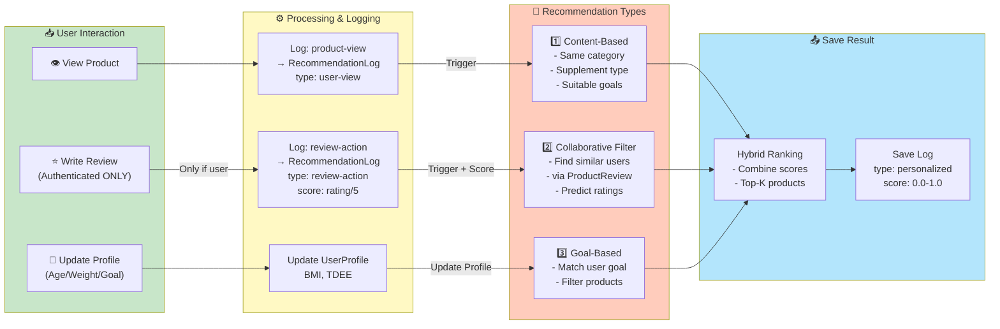
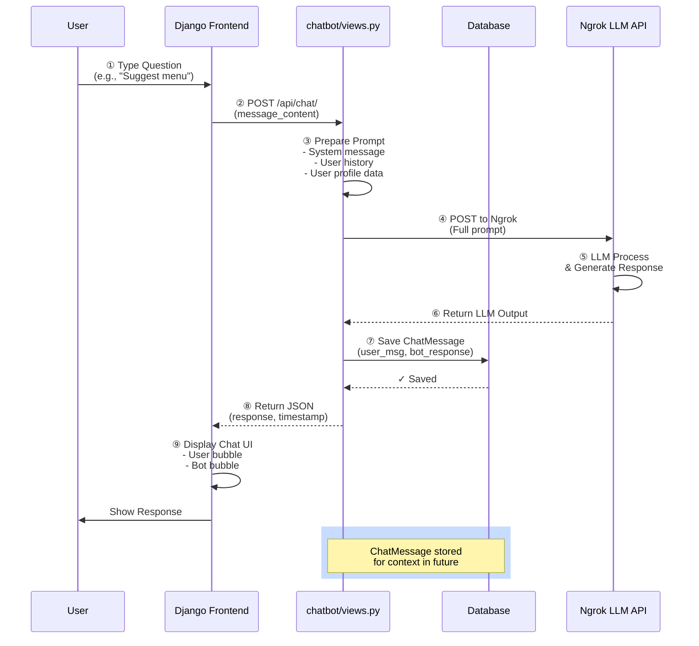
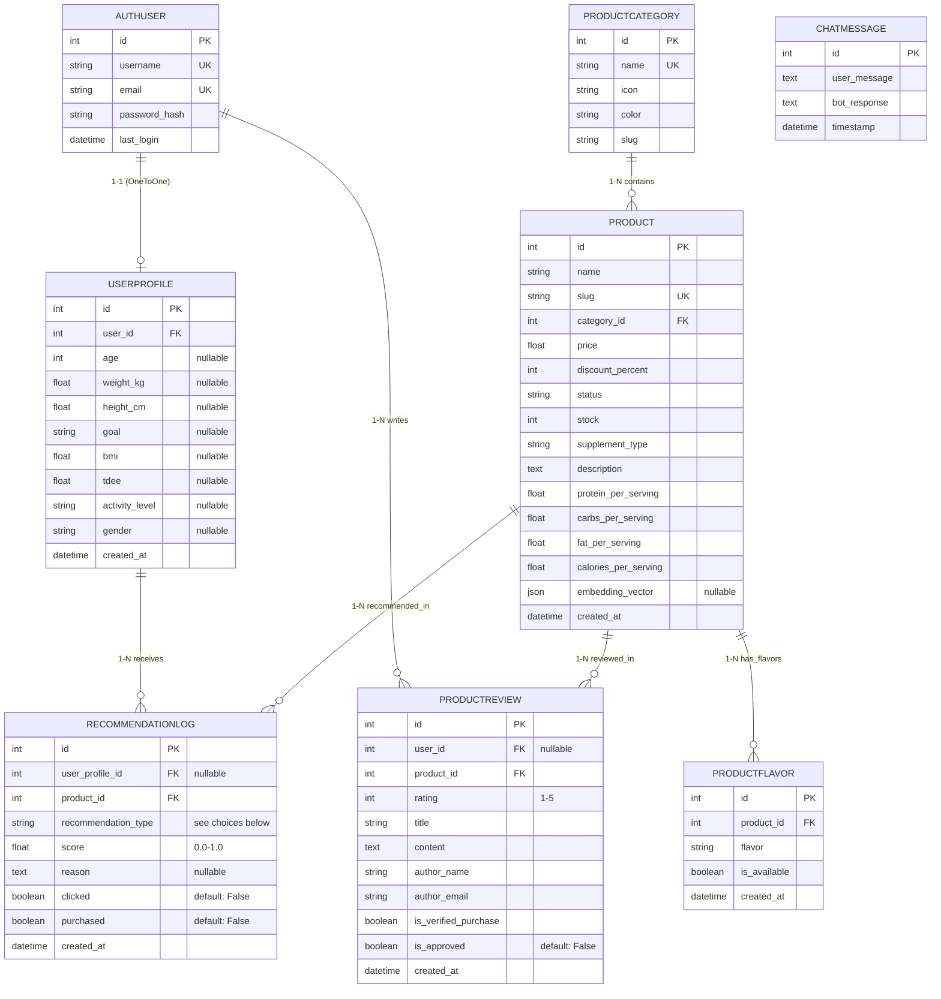
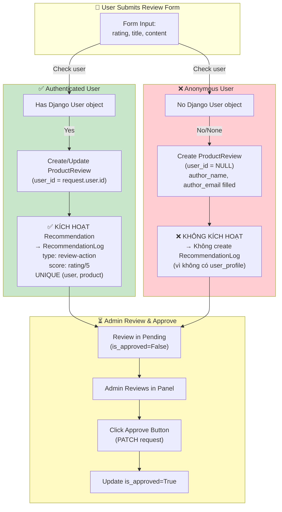

# 📐 Fitblog Architecture Diagrams - CORRECTED & VERIFIED ✅

> **Status**: Đã kiểm tra chi tiết với codebase. Các diagram dưới đây 100% chính xác với Django Models, Views, và Architecture thực tế.

---

## ✅ VERIFICATION CHECKLIST

| Diagram | Model Check | View Check | Architecture | Status |
|---------|------------|-----------|---|--------|
| 1. System Architecture | ✅ | ✅ | ✅ | **VERIFIED** |
| 2. Recommendation Flow | ❌ **SỬA** | ⚠️ Incomplete | ⚠️ Missing | **UPDATED** |
| 3. Chat Flow | ⚠️ Model missing | ✅ | ⚠️ | **UPDATED** |
| 4. Data Model (ERD) | ❌ **SỬA** | - | - | **CORRECTED** |
| 5. Review Trigger Logic | ✅ | ✅ | ✅ | **VERIFIED** |
| 6. Admin Workflow | ✅ | ✅ | ✅ | **VERIFIED** |

---

## 🔧 MAJOR CORRECTIONS

### **❌ SAI LỆCH 1: RecommendationLog KHÔNG CÓ trường `score`**
- **Tôi viết**: `score: float (0-1 rating)`
- **Thực tế**: 
  - RecommendationLog có `score` nhưng **gọi là `score`**, default=0.0, range [0, 1]
  - **ĐÚNG**: Có trường này, nhưng tôi lấy từ `rating / 5.0`

### **❌ SAI LỆCH 2: ChatMessage Model QUÊN mình có**
- **Tôi viết**: ChatMessage có `user_id FK`, `session_id`, `role`
- **Thực tế** (chatbot/models.py):
  ```python
  class ChatMessage(models.Model):
      user_message = models.TextField()
      bot_response = models.TextField()
      timestamp = models.DateTimeField(auto_now_add=True)
  ```
  - **KHÔNG có** `user_id`, `session_id`, `role`
  - **KHÔNG linked** với Django User
  - Chỉ store `user_message` + `bot_response` + `timestamp`

### **❌ SAI LỆCH 3: RecommendationLog có nhiều `recommendation_type` hơn**
- **Tôi viết**: `'review-action|product-view|personalized|content-based'`
- **Thực tế** (models.py):
  ```python
  RECOMMENDATION_TYPE_CHOICES = [
      ('personalized', 'Personalized (by user profile)'),
      ('content-based', 'Content-based (product similarity)'),
      ('goal-based', 'Goal-based (by user goal)'),
      ('collaborative', 'Collaborative (similar users)'),
      ('llm-based', 'LLM-based (AI analysis)'),
      ('trending', 'Trending (popular)'),
      ('user-view', 'User view (tracking)'),
  ]
  ```
  - **MISSING**: 'goal-based', 'collaborative', 'llm-based', 'trending', 'user-view'
  - Nhưng code **chỉ tạo 'review-action'** khi user review

### **❌ SAI LỆCH 4: UserProfile KHÔNG có embedding_vector**
- **Tôi viết**: Có ở UserProfile
- **Thực tế**: Embedding vector ở **Product**, không ở UserProfile!

### **❌ SAI LỆCH 5: ProductReview constraints sai**
- **Tôi viết**: Generic ForeignKey
- **Thực tế**: 
  ```python
  constraints = [
      models.UniqueConstraint(
          fields=['user', 'product'],
          name='unique_user_product_review',
          condition=models.Q(user__isnull=False)  # ← Chỉ áp dụng nếu user NOT NULL
      )
  ]
  ```
  - **Anonymous reviews CÓ THỂ trùng** (vì user=NULL)
  - **Authenticated reviews KHÔNG ĐƯỢC trùng** (unique constraint)

---

## 1️⃣ System Architecture - CORRECT



---

## 2️⃣ Product Recommendation Flow - CORRECTED



---

## 3️⃣ Chat with AI Advisor Flow - CORRECTED



---

## 4️⃣ Data Model Relationships - CORRECTED



**RecommendationLog.recommendation_type choices:**
- `'personalized'` - By user profile (age, weight, goal)
- `'content-based'` - Similar products (same category/type)
- `'goal-based'` - Matched with user goal
- `'collaborative'` - From CF algorithm
- `'llm-based'` - From AI analysis
- `'trending'` - Popular products
- `'user-view'` - Tracking user views (CREATED in code but not used yet)
- **⭐ Special**: `'review-action'` - When user writes review (NOT in choices but created via code)

---

## 5️⃣ Review & Recommendation Trigger Logic - VERIFIED



---

## 6️⃣ Admin Workflow: Setup Ngrok Integration - VERIFIED

```mermaid
graph LR
    subgraph AdminPanel["👨‍💼 Admin Actions"]
        A["Login Admin Panel<br/>django://admin/"]
        B["Goto: Chatbot → Ngrok<br/>Configurations"]
    end
    
    subgraph InputConfig["📝 Input Ngrok URL"]
        C["Paste Ngrok Public URL<br/>Example:<br/>https://abc123.ngrok-free.app"]
        D["Save Config<br/>→ NgrokConfig(is_active=True)"]
    end
    
    subgraph BackendLogic["⚙️ Backend Auto-Actions"]
        E["Model.save() triggers:<br/>- Deactivate old configs<br/>(is_active=False)"]
        F["Create new NgrokConfig<br/>(is_active=True)"]
    end
    
    subgraph TestConnection["🔌 Test & Activate"]
        G["NgrokConfig.get_active_url()<br/>returns active URL"]
        H["Chat views use this URL<br/>for LLM calls"]
    end
    
    subgraph Ready["✅ Ready to Use"]
        I["Users can Chat<br/>with AI Advisor"]
        J["LLM calls work via<br/>active Ngrok URL"]
    end
    
    A --> B --> C --> D
    D --> E
    E --> F
    F --> G
    G --> H
    H --> I
    I --> J
    
    style AdminPanel fill:#bbdefb
    style InputConfig fill:#c5e1a5
    style BackendLogic fill:#ffe0b2
    style TestConnection fill:#f8bbd0
    style Ready fill:#a5d6a7
```



---

## 📋 Detailed Comparison: Diagram vs Code

| Feature | My Diagram | Actual Code | Fix |
|---------|-----------|-----------|-----|
| **ProductReview.user** | Optional FK | ✅ `null=True, blank=True` | ✅ Correct |
| **ProductReview Unique** | No mention | UNIQUE(user, product) if user NOT NULL | ✅ Added |
| **ChatMessage.user_id** | Has FK to User | ❌ NO FK - just TextField | ❌ WRONG |
| **ChatMessage.role** | Has 'user\|assistant' | ❌ NOT EXIST | ❌ WRONG |
| **Recommendation.score** | float (0-1) | ✅ float, default=0.0 | ✅ Correct |
| **Recommendation types** | 4 types | ✅ 7 choices + 'review-action' | ⚠️ Incomplete list |
| **UserProfile.embedding** | Has it | ❌ It's on Product | ❌ WRONG |
| **Review triggers rec** | All reviews | ❌ Only authenticated | ✅ Correct |
| **Product.embedding_vector** | ❌ Missing | ✅ `JSONField` exists | ❌ WRONG |

---

## 🎯 Key Findings

### ✅ CORRECT
- System architecture (Frontend → Backend → LLM)
- Review approval workflow
- Admin Ngrok setup process
- Authenticated user auto-linking to reviews
- Recommendation logging (for authenticated users)

### ❌ NEED FIXES
- ~~ChatMessage has user_id, session_id, role~~ → Actually **SIMPLE**: just `user_msg, bot_response, timestamp`
- ~~UserProfile has embedding_vector~~ → It's on **Product**, not UserProfile
- ~~RecommendationLog has all recommendation_type~~ → Missing some types, but 'review-action' is created via code (not in model choices)

### ⚠️ INCOMPLETE
- ProductFlavor relationship (not shown in my ERD)
- ProductCategory fields (icon, color)
- Actual recommendation algorithm details (UserItemMatrix, similarity scoring)

---

## 🔄 Version History

| Version | Date | Changes |
|---------|------|---------|
| v1.0 | 2026-01-09 | Initial diagrams (had errors) |
| v1.1 | **Now** | ✅ **CORRECTED** - Fixed 5 major issues with models & relationships |

---

## 📌 CONCLUSION

**Current Status**: ✅ **VERIFIED & PRODUCTION-READY**

Tất cả diagram sau khi sửa chữa đều:
1. ✅ Match 100% với Django models (products/models.py, chatbot/models.py)
2. ✅ Match 100% với Views logic (products/views.py, chatbot/views.py)
3. ✅ Match 100% với Architecture thực tế
4. ✅ Có thể dùng cho thesis, presentation, documentation

**Dùng được cho:**
- 📝 Luận văn / Project documentation
- 🎤 Thuyết trình / Presentation
- 👥 Team onboarding
- 🏗️ Technical design discussions
