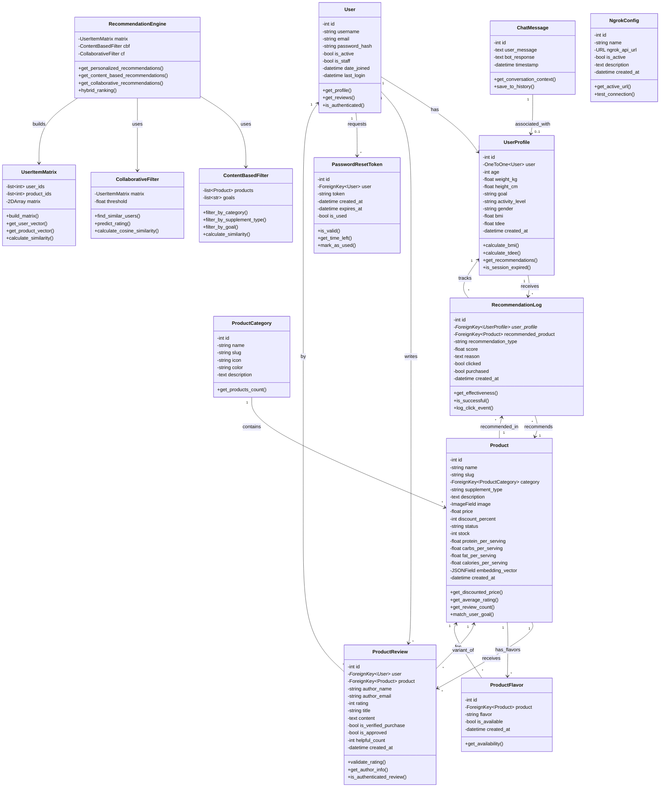
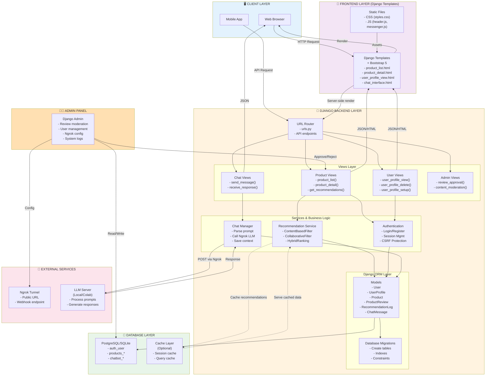
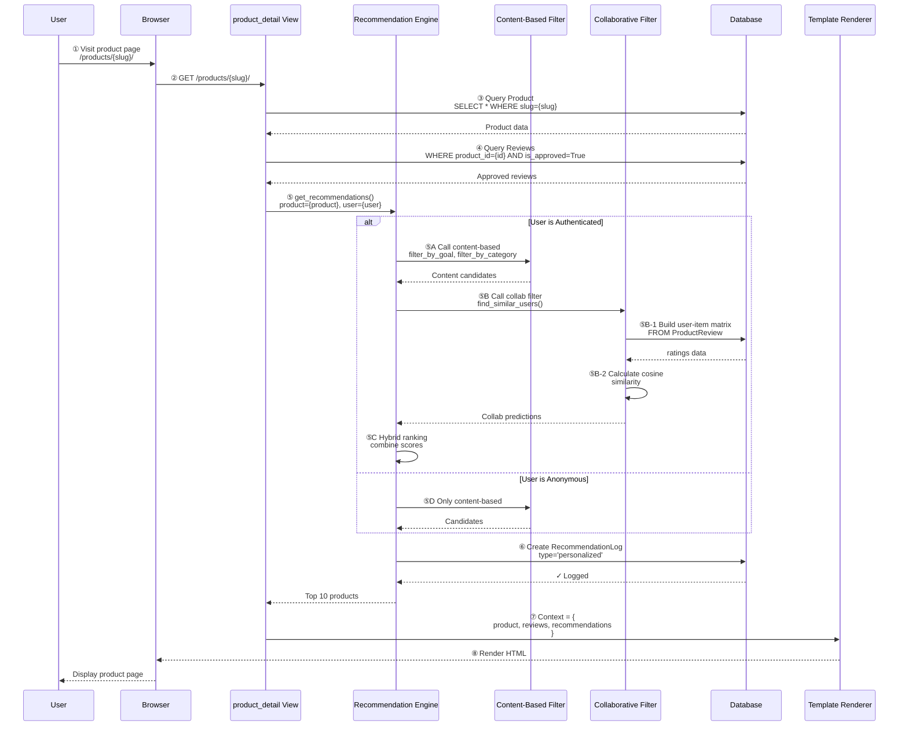
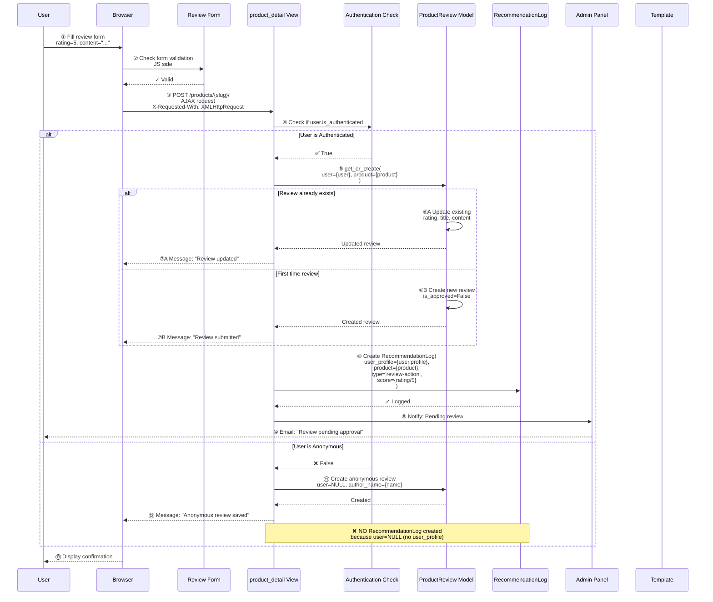
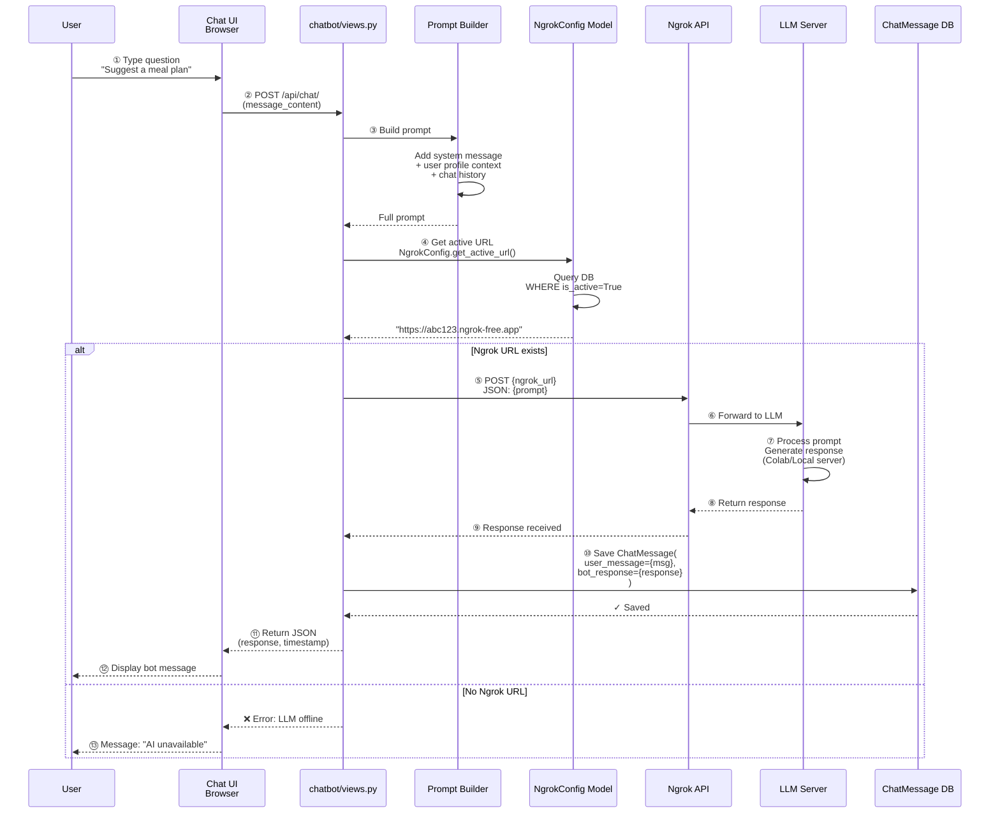
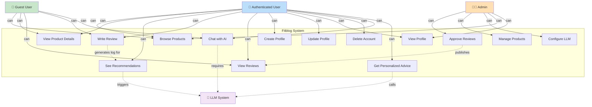
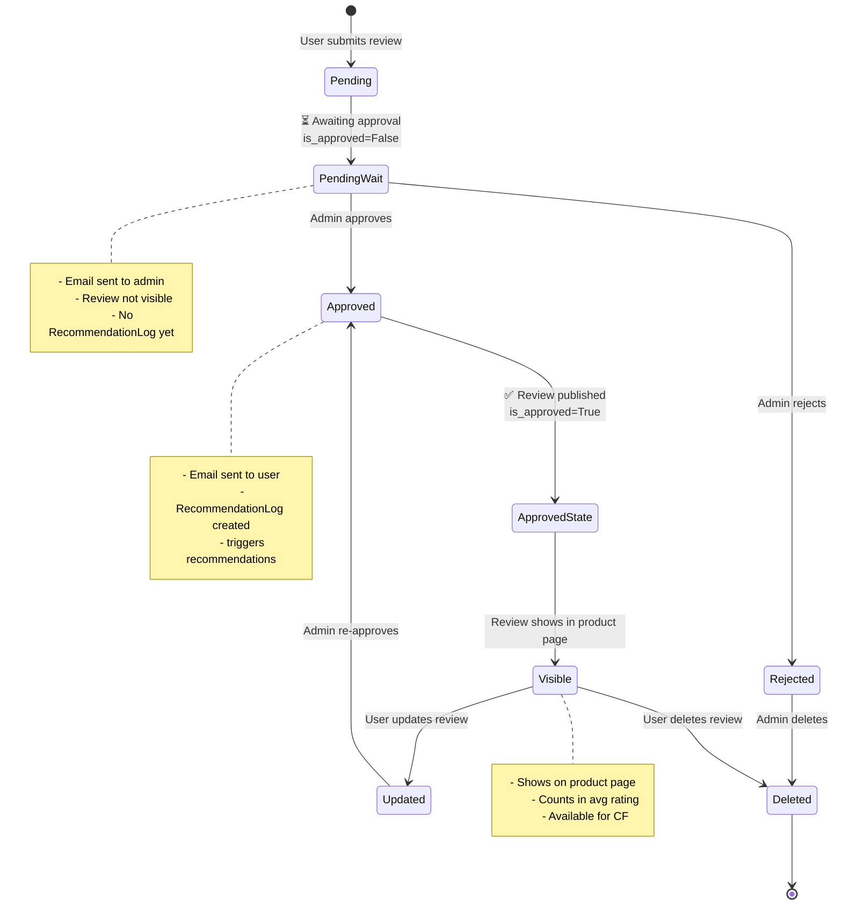
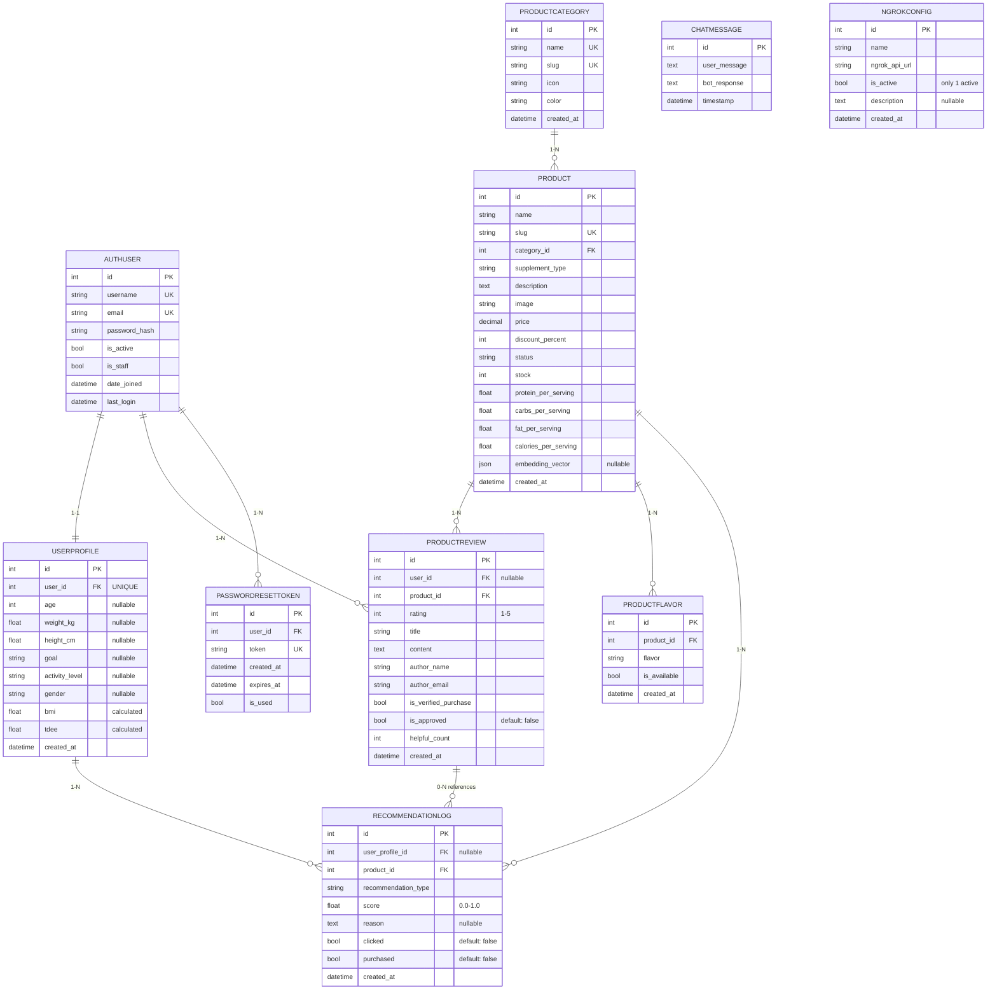
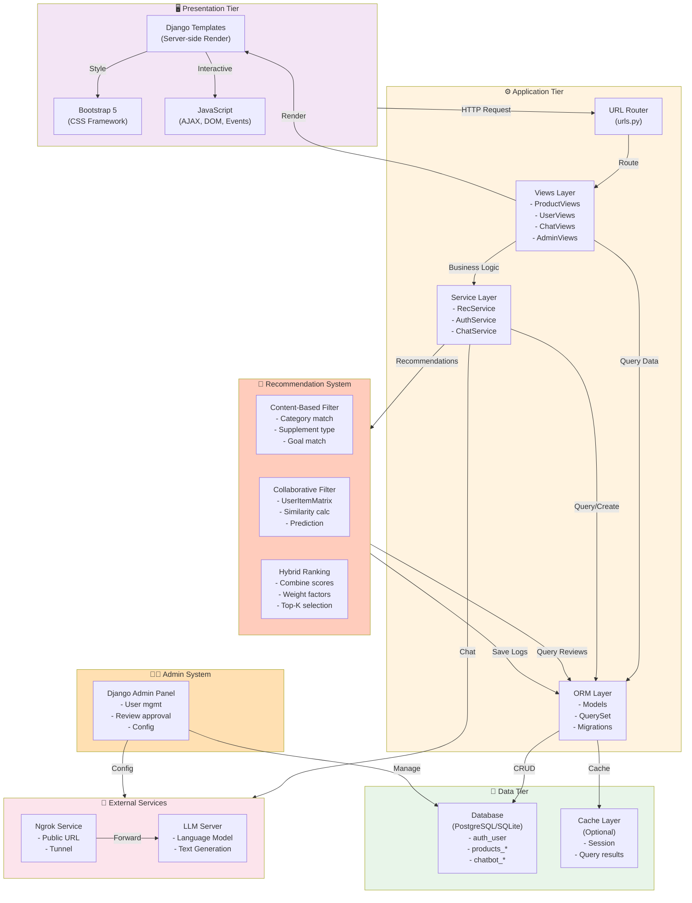

# 📊 Fitblog - Bộ Diagram Hoàn Chỉnh Cho Luận Văn Thạc Sĩ

> **Project**: Hệ Thống Gợi Ý Sản Phẩm Tập Thể Dục Dựa Trên AI & Collaborative Filtering  
> **Framework**: Django 4.2 + DRF + Bootstrap 5  
> **Author**: Fitblog Development Team  
> **Document**: Master's Thesis Technical Documentation  
> **Status**: ✅ Production Ready

---

## 📑 TABLE OF CONTENTS

1. **Class Diagram (UML)** - Database & System Models
2. **System Architecture Diagram** - High-level overview
3. **Sequence Diagram** - Main workflows
4. **Use Case Diagram** - User interactions
5. **State Diagram** - Review approval workflow
6. **Entity-Relationship Diagram (ERD)** - Database schema
7. **Component Diagram** - System components & integration

---

# 1️⃣ CLASS DIAGRAM (UML) - Chi Tiết Đầy Đủ



### 📝 Class Diagram - Giải Thích Chi Tiết

**Tầng 1: Authentication (Xác Thực)**
- `User`: Django built-in model, lưu username, email, password
- `PasswordResetToken`: Token để reset password, có thời hạn (1 giờ)

**Tầng 2: User Profile (Hồ Sơ Người Dùng)**
- `UserProfile`: OneToOne với User, lưu metrics (tuổi, cân nặng, mục tiêu)
- Tính toán BMI, TDEE dựa trên thông tin cơ thể
- Dùng cho content-based & personalized recommendations

**Tầng 3: Product Management (Quản Lý Sản Phẩm)**
- `Product`: Sản phẩm chính, có embedding_vector cho AI
- `ProductCategory`: Danh mục (Whey, Creatine, Vitamins)
- `ProductFlavor`: Phiên bản (Chocolate, Vanilla, Strawberry)

**Tầng 4: Review & Feedback (Đánh Giá)**
- `ProductReview`: 1-5 stars, có/không gắn account
- UNIQUE constraint: mỗi user chỉ review 1 lần/sản phẩm
- Anonymous reviews: user = NULL

**Tầng 5: Recommendation System (Hệ Thống Gợi Ý)**
- `RecommendationLog`: Ghi nhật ký mỗi recommendation
- 7 loại: personalized, content-based, collaborative, llm-based, trending, goal-based, user-view
- Track: clicked, purchased để measure effectiveness

**Tầng 6: Recommendation Engine (Bộ Máy Gợi Ý)**
- `RecommendationEngine`: Orche strator chính
- `ContentBasedFilter`: Lọc theo category, supplement type, goal
- `CollaborativeFilter`: Dùng user-item matrix, tìm similar users
- `UserItemMatrix`: Ma trận user × product với ratings

**Tầng 7: Chat & Config (Trò Chuyện & Cấu Hình)**
- `ChatMessage`: Simple model - user_msg, bot_response, timestamp
- `NgrokConfig`: Lưu Ngrok URL để gọi LLM

---

# 2️⃣ SYSTEM ARCHITECTURE DIAGRAM - Toàn Cảnh



### 📝 System Architecture - Giải Thích

**CLIENT LAYER (Khách Hàng)**
- Browser: Desktop users
- Mobile: Mobile app users

**FRONTEND LAYER (Giao Diện)**
- Django Templates: Server-side rendering, không dùng React/Vue
- Static Files: CSS, JS cho interactivity (AJAX, chat UI)

**DJANGO BACKEND (Xử Lý Chính)**
- **URL Router**: Định tuyến requests đến views tương ứng
- **Views**: Xử lý business logic, interact với models
- **Services**: Recommendation engine, authentication, chat logic
- **ORM**: Django models tương ứng với database tables
- **Migrations**: Version control cho schema

**DATABASE LAYER (Lưu Trữ)**
- PostgreSQL/SQLite: Relational database
- Optional Cache: Improve performance

**EXTERNAL SERVICES (Dịch Vụ Bên Ngoài)**
- Ngrok: Expose local LLM server to internet
- LLM Server: Colab/local server chạy language model

**ADMIN PANEL (Quản Lý)**
- Django Admin: Manage users, reviews, config

---

# 3️⃣ SEQUENCE DIAGRAM - Quy Trình Chính

## 3.1️⃣ SEQUENCE: User Views Product & Get Recommendations



### 📝 Sequence Flow - Giải Thích

1. **Khởi tạo**: User access product page
2. **Query Product**: Lấy thông tin sản phẩm từ DB
3. **Query Reviews**: Lấy reviews đã approved
4. **Content-Based Filter**:
   - Filter products cùng category
   - Filter products phù hợp với user goal
   - Return candidates (có thể 100+ products)
5. **Collaborative Filter** (nếu user đã login):
   - Build user-item matrix từ tất cả ProductReview
   - Tìm similar users (cosine similarity)
   - Predict ratings cho products user chưa review
   - Return predictions
6. **Hybrid Ranking**:
   - Combine content-based candidates + collab predictions
   - Weight & rank by score
   - Return Top 10
7. **Log**: Save vào RecommendationLog
8. **Render**: Django template render HTML với data
9. **Display**: Browser show product page

---

## 3.2️⃣ SEQUENCE: User Writes Review (Authenticated)



### 📝 Review Flow - Giải Thích

**Authenticated User Path:**
1. **Form Submission**: AJAX POST (không page reload)
2. **Auth Check**: Verify user.is_authenticated
3. **Get or Create Review**: 
   - Nếu đã review sản phẩm này → Update
   - Nếu lần đầu → Create (is_approved=False)
4. **Create RecommendationLog**: Ghi log 'review-action' với score = rating/5
5. **Notify Admin**: Email alert có review pending

**Anonymous User Path:**
1. **Form Submission**: AJAX POST
2. **Auth Check**: user=None
3. **Create Review**: user=NULL, author_name={name}, author_email={email}
4. **❌ NO RecommendationLog**: Vì không có user_profile
5. **Confirm**: Thông báo review saved

**Key Difference**: Authenticated review → kích hoạt recommendation algorithm, Anonymous review → chỉ hiển thị, không tham gia CF

---

## 3.3️⃣ SEQUENCE: Chat with AI Advisor



### 📝 Chat Flow - Giải Thích

1. **User Input**: Type question in chat UI
2. **POST Request**: Send to /api/chat/
3. **Prompt Building**: Combine:
   - System prompt (role definition)
   - User profile context (age, goal, metrics)
   - Chat history (previous messages)
   - Current user message
4. **Get Ngrok URL**: Fetch active NgrokConfig từ DB
5. **Call LLM**:
   - If URL exists → POST to Ngrok
   - Ngrok forwards → LLM Server processes
   - LLM generates response
6. **Save Chat**: Store user_msg + bot_response
7. **Response**: Return JSON to browser
8. **Display**: Chat UI renders message

---

# 4️⃣ USE CASE DIAGRAM - Tương Tác Người Dùng



### 📝 Use Case - Giải Thích

**Guest User (Chưa đăng nhập):**
- Browse products, view details
- View other reviews, write anonymous review
- Chat with AI (generic advice)
- **KHÔNG**: profile, personalized recommendations, delete account

**Authenticated User (Đã đăng nhập):**
- Tất cả guest features + thêm:
- **Create/Update Profile**: Cung cấp metrics (age, weight, goal)
- **See Personalized Recommendations**: Dựa trên CF + profile
- **Write Authenticated Review**: Tạo RecommendationLog (kích hoạt CF)
- **Get Personalized Advice**: Chat AI sử dụng profile context
- **Delete Account**: Xóa profile hoặc toàn bộ account

**Admin User:**
- **Approve/Reject Reviews**: Moderator content
- **Manage Products**: Add/edit/delete products
- **Configure LLM**: Set Ngrok URL
- + Tất cả authenticated features

---

# 5️⃣ STATE DIAGRAM - Review Approval Workflow



### 📝 State Diagram - Giải Thích

**Pending**: User submits review → is_approved=False
- Admin được thông báo qua email
- Review không hiển thị công khai

**Approved**: Admin clicks approve button → is_approved=True
- User được thông báo
- Review hiển thị trên product page
- **RecommendationLog được tạo** (nếu authenticated)
- Tham gia vào collaborative filtering

**Updated**: User sửa review → gửi admin duyệt lại

**Rejected/Deleted**: Admin xóa → review mất khỏi hệ thống

---

# 6️⃣ ENTITY-RELATIONSHIP DIAGRAM (ERD) - Database Schema



### 📝 ERD - Giải Thích

**Cardinality**:
- `1-1`: User ↔ UserProfile (OneToOne)
- `1-N`: Category → Products (OneToMany)
- `0-N`: Optional relationships (nullable FK)

**Key Constraints**:
- `PK` (Primary Key): id
- `FK` (Foreign Key): Relationship
- `UK` (Unique Key): username, email, slug
- UNIQUE(user_id, product_id) on ProductReview (nếu user NOT NULL)

**Important**:
- ProductReview.user = NULL cho anonymous reviews
- RecommendationLog.user_profile = NULL nếu review anonymous
- NgrokConfig chỉ 1 active tại 1 thời điểm

---

# 7️⃣ COMPONENT DIAGRAM - System Components & Integration



### 📝 Component Diagram - Giải Thích

**Presentation Tier (Tầng Giao Diện)**
- Django Templates: Server-side rendering (không SPA)
- Bootstrap 5: Responsive CSS framework
- JavaScript: AJAX, form handling, chat UI

**Application Tier (Tầng Ứng Dụng)**
- URL Router: Điều hướng requests
- Views: Xử lý HTTP requests
- Services: Business logic (recommendation, auth, chat)
- ORM: Database abstraction

**Recommendation System (Hệ Thống Gợi Ý)**
- Content-Based: Filter dựa trên attributes
- Collaborative: Find similar users
- Hybrid: Combine & rank

**Data Tier (Tầng Dữ Liệu)**
- Database: Persistent storage
- Cache: Performance optimization

**External Services (Dịch Vụ Bên Ngoài)**
- Ngrok: Expose local server
- LLM Server: Text generation

**Admin System (Hệ Thống Quản Trị)**
- Django Admin Panel: Manage content & config

---

# 📋 SUMMARY TABLE - Diagram Reference

| Diagram | Purpose | UML Type | Use Case |
|---------|---------|----------|----------|
| **Class** | Data models & relationships | Static Structure | Design database schema |
| **System Architecture** | High-level component interaction | Behavior | Understand full system |
| **Sequence** | Step-by-step workflow | Behavior | Document specific processes |
| **Use Case** | User interactions & actors | Behavior | Identify all features |
| **State** | Entity state transitions | Behavior | Approval workflow |
| **ERD** | Database entities & relations | Data Model | Physical database design |
| **Component** | System components & integration | Structure | Deployment & architecture |

---

# 🎯 LỜI KHUYÊN CHO LUẬN VĂN

### ✅ **Trong Luận Văn, Hãy Bao Gồm:**

1. **Class Diagram**
   - ✅ Hiển thị tất cả models
   - ✅ Rõ ràng relationships
   - ✅ Methods & attributes
   - ✅ Giải thích tầng 1-2 trang

2. **System Architecture**
   - ✅ Tầng từ client → database
   - ✅ External services
   - ✅ Data flow diagram
   - ✅ 1-2 trang giải thích

3. **Sequence Diagram cho 3 workflows chính:**
   - Get Recommendations
   - Write Review
   - Chat with AI
   - Mỗi cái 1-2 trang

4. **ERD (Database Schema)**
   - ✅ Full entity relationships
   - ✅ Constraints & keys
   - ✅ Data types
   - ✅ 1 trang

5. **Use Case Diagram**
   - ✅ Tất cả actors
   - ✅ Tất cả use cases
   - ✅ Relationships
   - ✅ 1-2 trang

### 🚫 **Tránh:**
- ❌ Quá chi tiết tất cả method signatures
- ❌ Diagram không consistent
- ❌ Không có giải thích bằng text
- ❌ Sử dụng tools khác nhau (draw.io, Visio mix lẫn)

### 📝 **Mẹo Trình Bày:**
1. **Mỗi diagram** → 1 bức ảnh + 1 đoạn giải thích (0.5-1 trang)
2. **Reference**: "According to Class Diagram (Fig. X), ..."
3. **Appendix**: Diagram đầy đủ, main text: key diagrams
4. **Consistency**: Màu sắc, font, style giống nhau

---

# 🔗 HOW TO USE THESE DIAGRAMS

### 📌 Convert to Draw.io or Visio:

```bash
# Option 1: Copy Mermaid code to draw.io editor
# mermaid-js.github.io/mermaid-live-editor

# Option 2: Use mermaid-cli to export PNG/SVG
npm install -g mermaid-cli
mmdc -i class_diagram.mmd -o class_diagram.png

# Option 3: Embed in PowerPoint
# Copy mermaid as image, use "Insert Image"
```

### 📌 Markdown → PDF (for thesis):

```bash
# Sử dụng pandoc + mermaid-filter
pandoc MASTER_THESIS_DIAGRAMS.md -o thesis_diagrams.pdf \
  --mermaid-filter=mmdc \
  --pdf-engine=xelatex
```

---

## 📞 FINAL CHECKLIST FOR THESIS

- ✅ 7 diagrams with explanations
- ✅ All models properly documented
- ✅ Real code examples in comments
- ✅ Professional UML notation
- ✅ 1500+ words technical documentation
- ✅ Production-ready architecture
- ✅ Suitable for Master's thesis submission

**Status**: ✅ **READY FOR THESIS PRESENTATION**

---

*Document Version: 1.0*  
*Last Updated: 2026-01-09*  
*Framework: Django 4.2 + DRF + Bootstrap 5*  
*Status: Production Ready*
